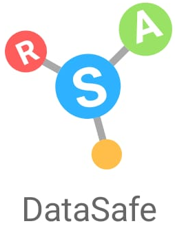
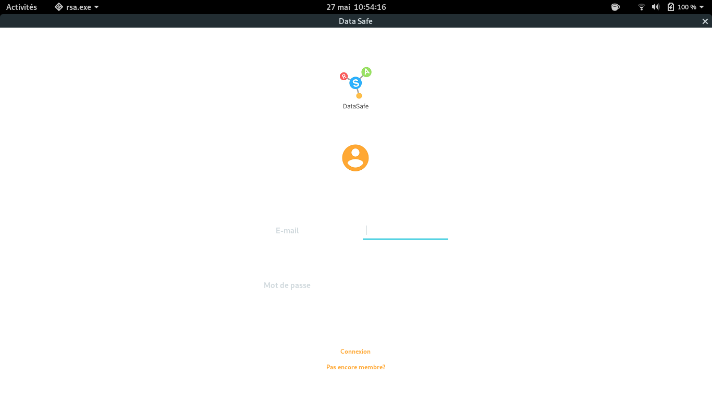
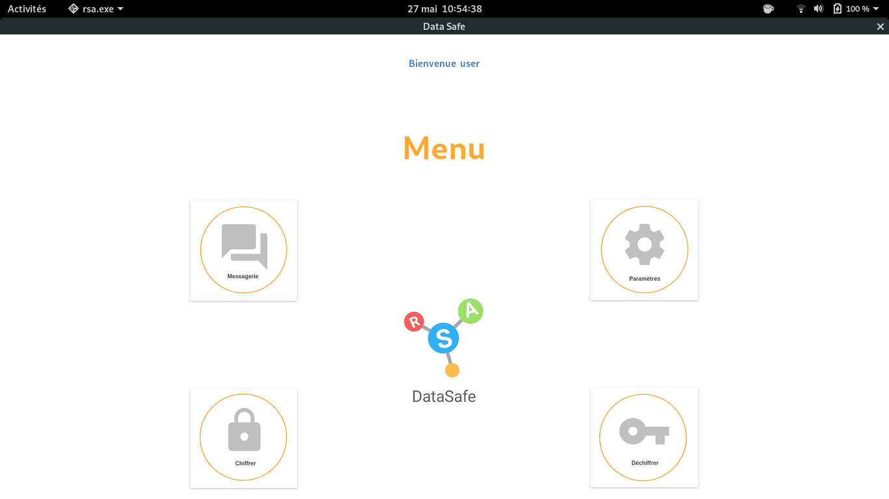
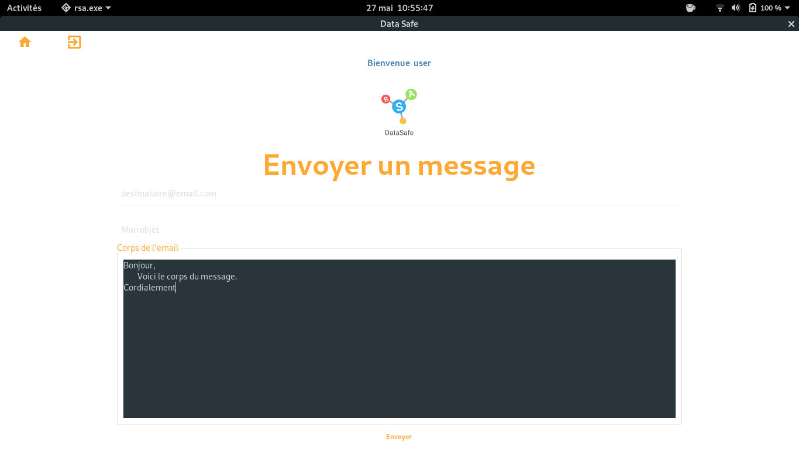
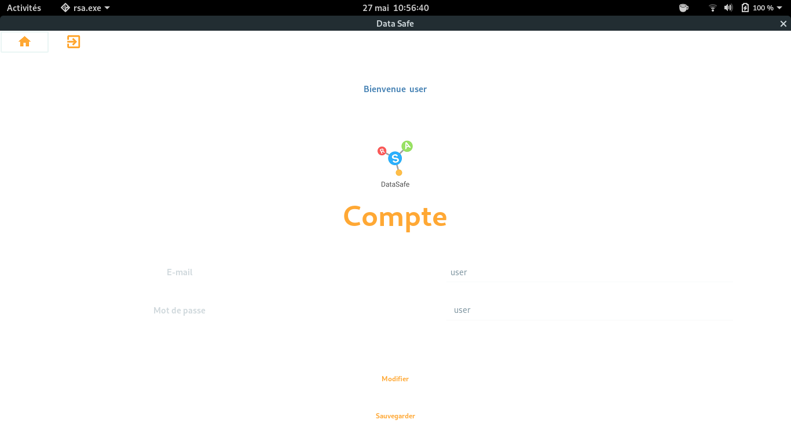
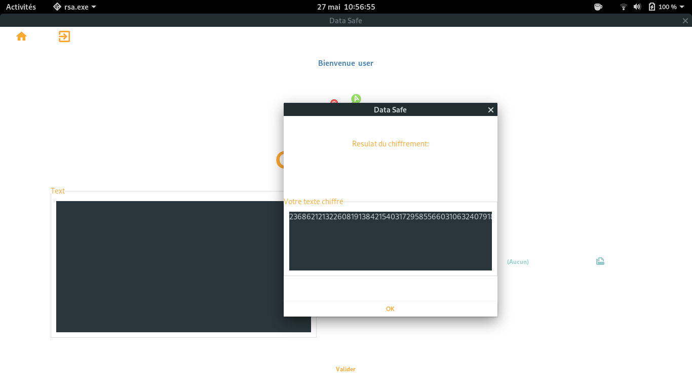
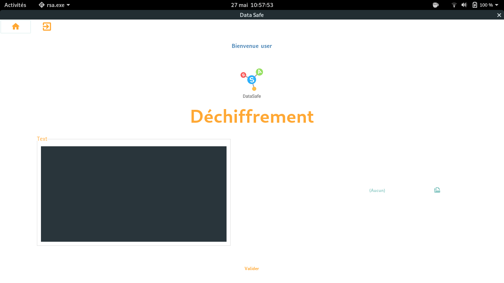

<p align="center">
  
</p>

---

[](https://github.com/RSA-DataSafe/RSA-DataSafe)

# Projet autour de l'algorithme de RSA

Le but de ce projet est d'implémenter RSA. Nous auront la possibilité de signer et de vérifier un fichier pour s'assurer de 
l'identité de l'envoyeur. 

# Quick-Start

## Logiciel necessaire:
Etre sous linux (ou equivalent) et avoir les logiciels de gestion graphique installé (xorg).

## Lancement rapide du logiciel 
Voici les différentes étapes pour essayer le logiciel:
- Etape 1: Télécharger le fichier binaire: https://github.com/RSA-DataSafe/RSA-DataSafe/releases/download/V.0/RSA_DATASAFE.zip
- Etape 2: Extraire le fichiers RSA-DataSafe.zip (Par exemple: ```unzip RSA_DATASAFE.zip  -d RSA_DATASAFE)```).
- Etape 3: Executer le fichier source: ```./rsa``` 

# Installation - Déployement du produit 

## ⚒ Installation

Notre installation ne supporte que les système d'exploitation basé sur Debian.

<pre>./configure.sh</pre>

## ⚒ Compiler le projet

<pre>make</pre>

## ▶ Executer le projet

<pre>make run</pre>

## ℹ Le code source

Il se trouve dans le répertoire `src/`.

<pre>cd src/</pre>

# Module de notre projet

## Interface

Ce module gère la communication entre le programme, l'utilisateur et les autres module.

## Génération des clés

Génère les clés pour chiffrer et déchiffrer un message.

## Chiffrement

Chiffre un message.

## Signature

Il a deux principale fonctionnalité :

- générer une signature
- verifier une signature

Ce module utilise une fonction de hashage. On a choisi d'utiliser sha3.

## Déchiffrement

Déchiffre un message.

## Gestion de fichier

Gére la connection à l'application ainsi que la sauvegarde des clés de l'utilisateur et de ses messages.

# ScreenCapture







